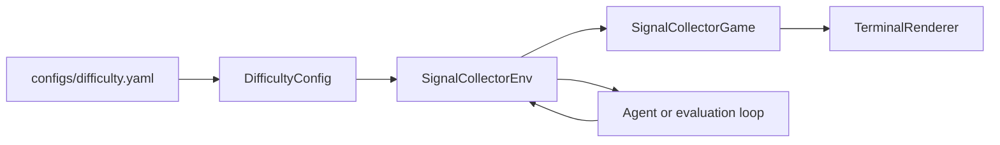

# Gymnasium Game Wrapper

Signal Collector is a small 2D collection-and-avoidance game wrapped as a Gymnasium-compatible reinforcement learning environment. The agent moves around a grid, collects signal tokens, avoids hazards, and faces adaptive difficulty stages that change hazards, rewards, episode length, and hazard movement.

The project is intentionally lightweight. It focuses on the engineering pattern of connecting game or simulation logic to a standard RL interface without making the game itself unnecessarily complex.

## Why This Project Matters

Many adaptive simulation platforms already have game logic or front-end environments. Research engineering work often involves wrapping that logic in stable interfaces so agents, runtime controllers, and evaluation tools can interact with it. This project demonstrates that bridge: a game engine remains separate from the Gymnasium environment wrapper.

## Relevance to Adaptive RL Systems & Simulation Architecture

This project connects directly to adaptive RL systems because it provides a standard agent-environment interface around a configurable game simulation. The adaptive difficulty schedule models runtime task changes, while the modular design separates game dynamics, configuration, rendering, and Gymnasium integration.

It is relevant to simulation architecture because the same pattern can be extended to richer games: keep core simulation logic independent, then expose reset/step/render methods and typed observations for RL workflows.

## Features

- `SignalCollectorGame` core game engine
- `SignalCollectorEnv` Gymnasium-compatible wrapper
- YAML-driven difficulty schedule in `configs/difficulty.yaml`
- Difficulty stages: easy, medium, hard, expert
- Optional moving hazards in expert mode
- Dict observations with agent, signal, hazard, difficulty, and remaining-step state
- Terminal renderer for quick inspection
- Random rollout, difficulty inspection, and random-policy evaluation examples
- Tests for game rewards, hazards, Gymnasium API shape, invalid actions, and difficulty changes

## Installation

```bash
pip install -r requirements.txt
```

## Usage

Run a random agent:

```bash
python examples/run_random_agent.py
```

Inspect difficulty changes:

```bash
python examples/inspect_difficulty_changes.py
```

Evaluate a random policy:

```bash
python examples/evaluate_random_policy.py
```

Run tests:

```bash
python -m pytest
```

## Quick Demo Output

`examples/inspect_difficulty_changes.py` shows the configured stage transitions:

```text
episode=00 difficulty=easy    status=transition hazards=1 signals=3
episode=05 difficulty=medium  status=transition hazards=3 signals=4
episode=10 difficulty=hard    status=transition hazards=5 signals=4
episode=15 difficulty=expert  status=transition hazards=6 signals=5
```

Random-policy evaluation prints a compact stage summary:

```text
Random policy evaluation over 24 episodes
difficulty  episodes  avg_reward  completion_rate
----------------------------------------------------
easy              5       -0.37             0.00
medium            5        0.24             0.00
hard              5       -1.22             0.00
expert            9       -0.75             0.00
```

## Environment API

```python
from signal_collector import SignalCollectorEnv

env = SignalCollectorEnv()
observation, info = env.reset()
observation, reward, terminated, truncated, info = env.step(4)
```

Actions:

- `0`: up
- `1`: down
- `2`: left
- `3`: right
- `4`: stay

Observation fields:

- `agent`: agent row and column
- `signals`: binary grid mask of signal locations
- `hazards`: binary grid mask of hazard locations
- `difficulty`: active difficulty index
- `remaining_steps`: remaining episode budget

## Architecture



## Future Improvements

- Add a pygame or browser-based renderer for visual debugging
- Add a Gymnasium registration entry point
- Add curriculum schedules based on recent agent performance
- Add vectorized environment examples for training experiments
- Add wrappers for flattening observations for simple RL baselines
